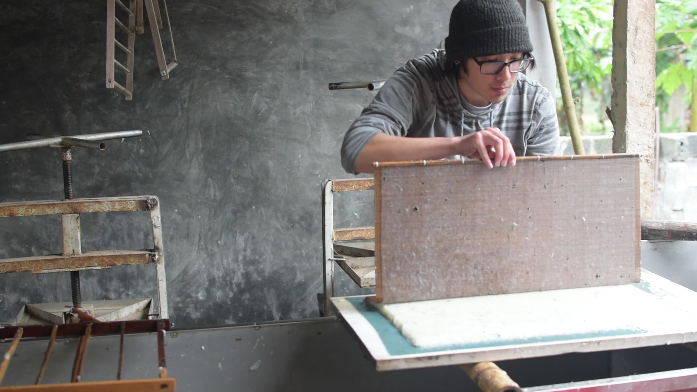

---
---

<link rel="stylesheet" href="styles.css" type="text/css">

I am a Ph.D. candidate in the department of Ecology, Evolution, and Population Biology at [Washington University in St. Louis](http://dbbs.wustl.edu/curstudents/Pages/student_bio.aspx?SID=7333), where I am advised by Dr. [Robbie Hart](https://h4rt.squarespace.com/), director of the William L. Brown Center at the [Missouri Botanical Garden](https://www.missouribotanicalgarden.org/).

My dissertation research is on the ethnobotany of hand papermaking traditions, with particular attention to those of Nepal and northern Vietnam.

[CV](files/ojascastro_resume.pdf)

Copyright © 2020 James Ojascastro.  
All rights reserved.