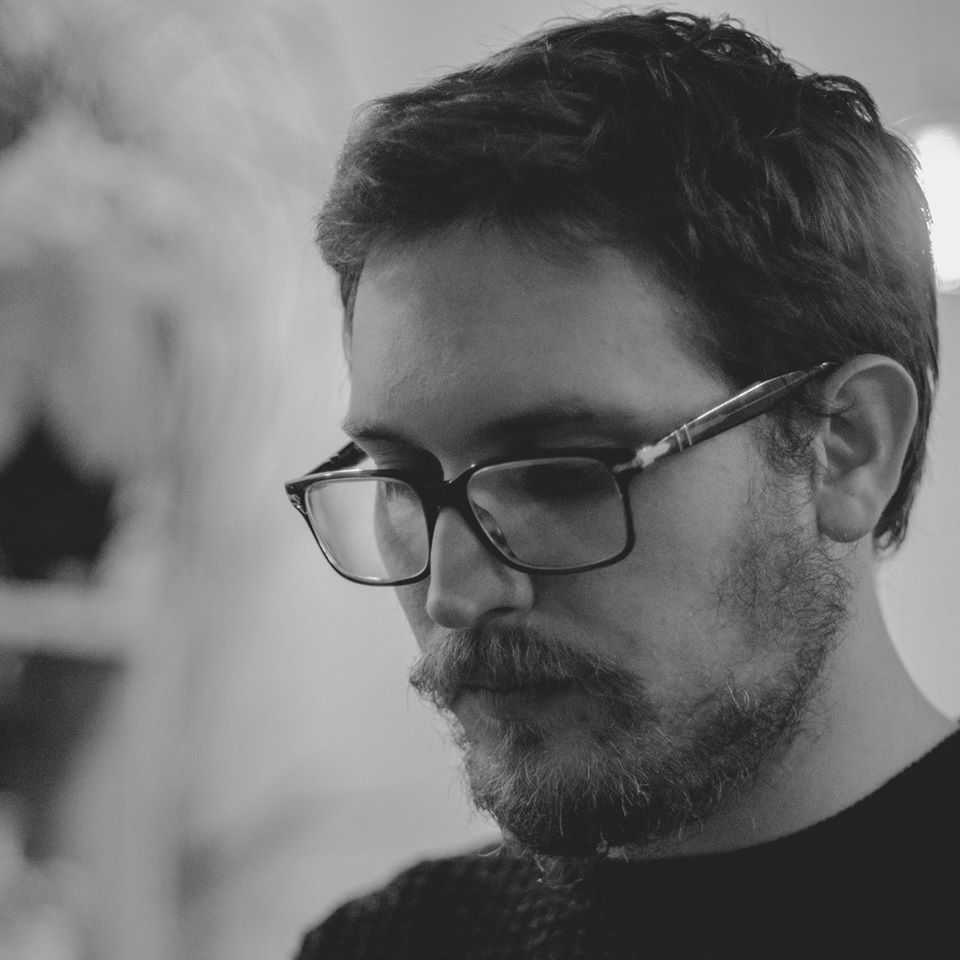
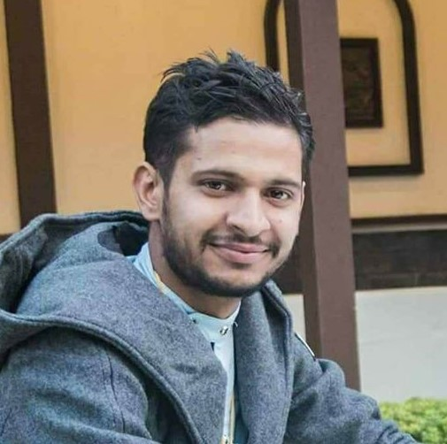

My research would not be possible without the guidance of mentors and collaborators from across many disciplines.  They include:

  

  
  

  

**[Robbie Hart](https://h4rt.squarespace.com/)**    
Director, William Brown Center  
Missouri Botanical Garden

Robbie is an interdisciplinary scientist whose research focuses on high-elevation plant ecology, climate change, and ethnobotany---and particularly the areas in which these three topics overlap.  His research most frequently takes him to the eastern Himalaya, where he surveys [rhododendrons](files/Hart & Salick 2018.pdf) and [**GL**obal **O**bservation **R**esearch **I**n **A**lpine environments (GLORIA)](https://gloria.ac.at/home) permanent plots to understand the effects of climate change.
  

 

  

  
  

  

**[Michael Powell](https://www.studiopowell.co/)**    
Papermaker, Washington University in St. Louis  
Director of Marketing & Design, [Craft Alliance](https://craftalliance.org/)  

Michael is a St. Louis-based visual artist who specializes in website design, publication design, and papermaking.  He runs the Paper Lab at the Sam Fox School of Design & Visual Arts at WashU.
  

 

  

  
  

  

**Tran Hong Nhung**    
Founder, [Zo Project](http://zopaper.com/)  

Although [hand papermaking has been practiced in northern Vietnam for over eight centuries](http://www.bbc.com/travel/story/20160817-the-handmade-paper-that-lasts-800-years), globalization and industrialization has all but driven it to extinction.  Today, just a few families of artisans make paper by hand in northern Vietnam.  Since 2013, Nhung has sponsored some of Vietnam's last papermakers by selling their handmade fans, notebooks, and posters at her brick-and-mortar shop in Hanoi.  Her efforts help preserve an integral part of Vietnam's cultural heritage.
  

 

  

  
  

  

**Bikram Jnawali**    
Lecturer, Pentagon International College, Nepal

Bikram recently received his Master's degree in Botany from Tribhuvan University in Nepal, for a thesis on the population structure of lokta (*Daphne bholua*), a bush harvested throughout the Himalaya to make paper.  He helped me to locate populations of lokta and argeli (*Edgeworthia gardneri*) and conduct interviews with Nepalese papermakers across central and eastern Nepal.
  

