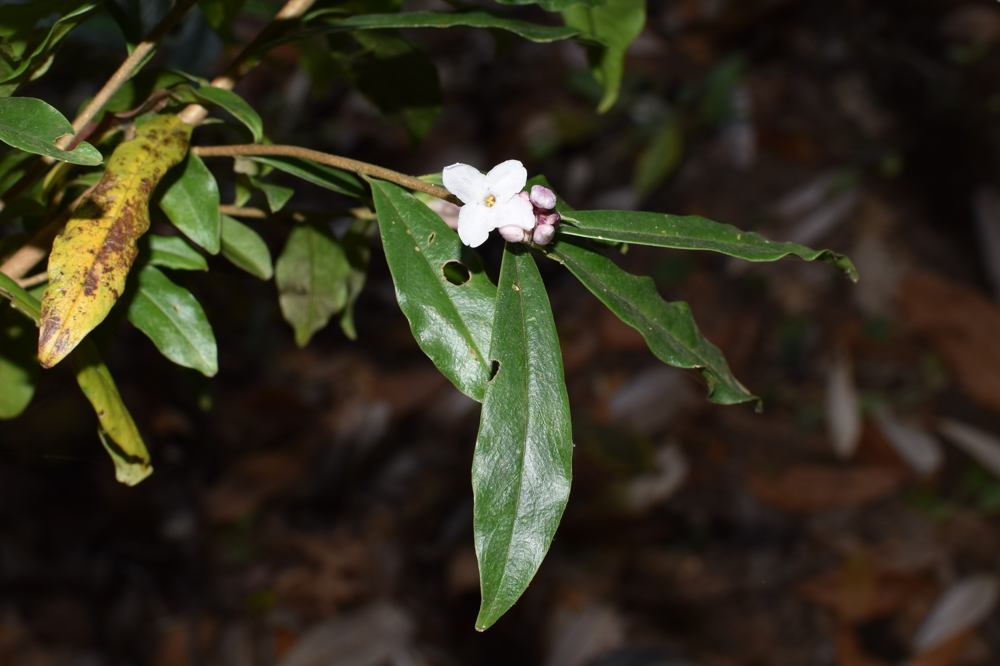
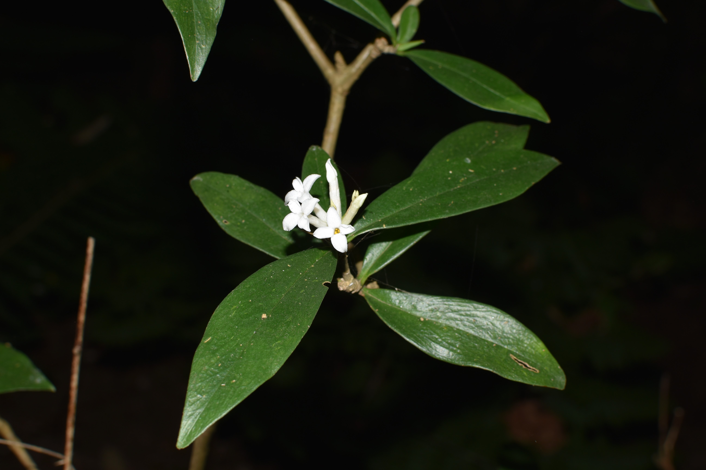
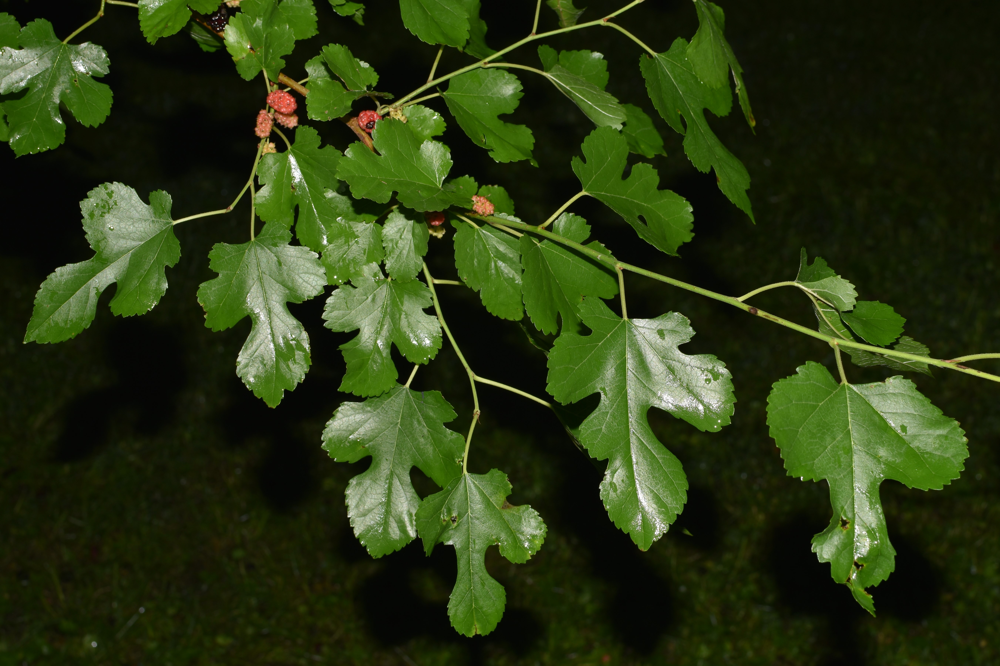
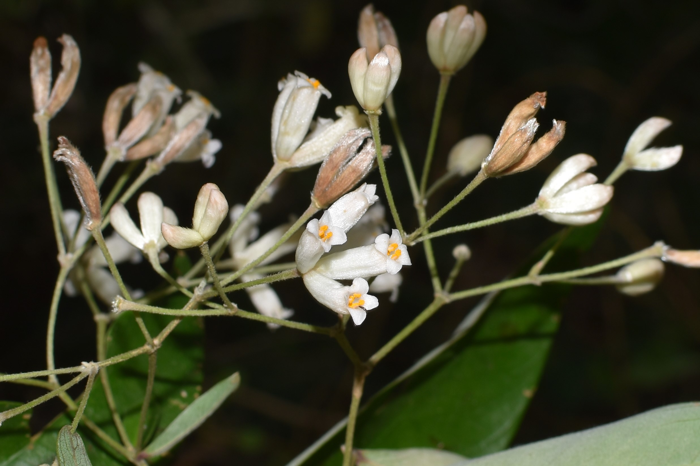
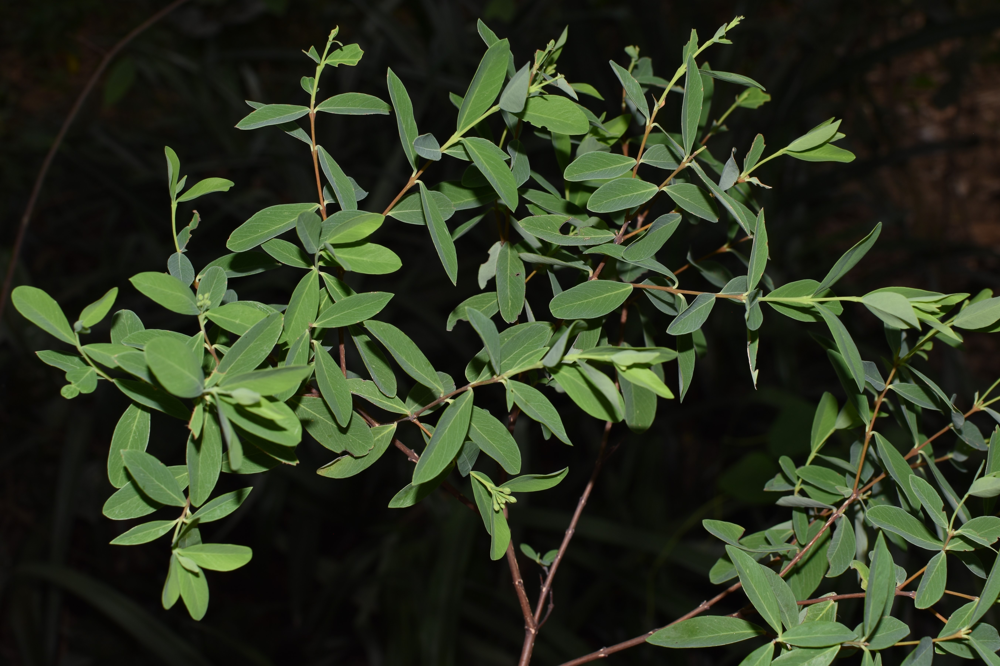

Introduction

Hundreds, if not thousands, of species have been harvested for their fiber, including for paper. Although most anatomical parts of a plant may be in theory used for making paper, depending on the species the most fibrous parts may originate from the leaves, stems, or even roots.  Most paper today is made from stems—specifically, the wood—as harsh chemical and mechanical processes make it possible to break down the tough lignin network that cements cellulose fibers together.  But for much of history, the sheer toughness of lignin has made it impossible to make paper from wood by hand.  Instead, many hand papermakers—especially in Mesoamerica and east + southeast Asia—have converged on harvesting the fibers from phloem, the thin ring of tissue between the bark and wood of dicotyledenous plants.  By converging on harvesting phloem fibers (also called bast fibers) for papermaking, papermakers in the Americas and in Asia have also converged on selecting a remarkably diverse array of species for papermaking, which together share remarkably similar traits—and evolutionary histories.  As you read these plant descriptions, notice that they tend to occur in just two plant families: the [Thymelaeaceae](https://en.wikipedia.org/wiki/Thymelaeaceae/), or mezereum family; and the [Moraceae](https://en.wikipedia.org/wiki/Moraceae), or fig family.

Paper plants

  

  
  

  

**Paper mulberry**    
*Broussonetia papyrifera* (L.) L'Hér. ex Vent  
Family Moraceae

Widespread and fast-regenerating, paper mulberry has been the predominant source of fiber for making paper across much of warm temperate and tropical East Asia for as long as two millennia.  Its fibers are long, tough, and coarse, and well-suited for making durable paper used for painting, calligraphy, and origami.  Across the Pacific Islands, paper mulberry bast is not used for making paper, but it instead is beaten to make a coarse cloth called tapa, which is often brightly painted.  Tapa garments are generally worn and gifted on special occasions.
  

 

  

  
  

  

**Kalo lokta**  
*Daphne bholua* Buch.-Ham. ex D.Don  
Family Thymelaeaceae

Kalo lokta is the main source of bast fiber used for making paper (also called lokta) in Nepal and Bhutan.  Like other members of the Thymelaeaceae, the lokta bush has long bast fibers and insecticidal sap, which confer remarkable durability to lokta paper: some documents printed on lokta date from the first millennium CE.  Lokta paper is still used today for official documents in Nepal’s government, and to make souvenir prints and paintings for sale to tourists in Kathmandu.
  

 

  

  
  

  

**Seto lokta**  
*Daphne papyracea* Wall. ex G.Don  
Family Thymelaeaceae

Seto lokta is one of three main species in the family Thymelaeaceae used to make paper by hand in Nepal and Bhutan.  It grows in shaded forests across Kashmir, the Himalaya, and southern China at elevations between 1500 and 2100 meters above sea level.
  

 

  

  
  

  

**Argeli**  
*Edgeworthia gardneri* Meisn.  
Family Thymelaeaceae

Argeli is a tall (up to 4 m) spreading bush native to the moist, mid-elevation (2400-3500 m a.s.l.) foothills of Sikkim, Bhutan, eastern Nepal, and southern China. Like its relative mitsumata (*Edgeworthia tomentosa*), argeli fibers are relatively short and very soft, and paper made from both species are prized in Japan for their delicate, gossamer-like qualities.  However, Nepalis consider argeli paper inferior, since argeli fibers are shorter and weaker than lokta fibers.  Despite this, due to overharvesting of lokta bushes, argeli fibers are becoming more frequently used in Nepalese hand papermaking industries today.
  

 

  

  
  

  

**White mulberry**    
*Morus alba* L.  
Family Moraceae  

White mulberry has been cultivated in China for over four millennia.  Its chief use is as a food source for raising silkworms, which voraciously eat its glossy, lobed leaves.  But people have long consumed white mulberry too: its sweet fruits may be made into wine, and its leaves can be steeped to make tea.  Leaf and root extracts have been used medicinally, and metabolites in their tissues have antimicrobial and antihyperglycemic properties.  Although its inner bark fibers have been [used to make paper money in Ming dynasty China](files/Cartwright et al. 2014.pdf), it is rarely used in hand papermaking today.  Those that wish to revive this tradition in the eastern USA can easily do so, as white mulberry has become a ubiquitous and troublesome invasive species there.
  

 

  

  
  

  

**Dó**    
*Rhamnoneuron balansae* (Drake) Gilg  
Family Thymelaeaceae  

For over eight centuries, artisans in northern Vietnam relied on fibers harvested from the bast of dó, a small (2 - 4 m tall) tree native to the hilly Hong River watershed to make their paper. Historically, dó was used for calligraphy, packaging fireworks, and ornate Đông Hồ paintings.  However, mechanization of papermaking from timber pulp in Hòa Bính Province has driven this once-flourishing tradition almost to extinction.  Today, dó paper is made in only two villages on the outskirts of Hanoi, and its expense precludes many of its former uses.  Despite its uncertain future, dó paper has achieved a cult following among origami artists around the world, who prize its soft yet exceptionally strong fibers for folding complex designs.
  

 

  

  
  

  

**Dó liệt**    
*Wikstroemia indica* (L.) C.A.Mey.  
Family Thymelaeaceae  

Those familiar with traditional Chinese medicine might recognize dó liệt, which is extensively used to treat a variety of ailments, including fevers, coughs, and intestinal worms.  But in Quỳnh Lưu, Vietnam, harvesters strip bark from dó liệt bushes to sell to just three families of artisans who live in Nghi Phong, just outside the city of Vinh.  These artisans then cook and beat the dó liệt bark to make a thin, translucent paper.  This paper is then sold to fishermen in Vinh, who use it as a packaging material to keep fish fresh and intact.
  

